# IsoLog: Portable SIEM Architecture Plan

## Executive Summary

**IsoLog** is a portable, offline-capable Security Information and Event Management (SIEM) system designed for isolated/air-gapped networks. It provides local threat monitoring, detection, and visualization without requiring internet connectivity, with support for manual offline updates and tamper-evident log verification via blockchain hashing.

---

## System Architecture Overview


---

## Data Flow Diagram


---

## Module Responsibilities

### 1. Ingestion Module (`backend/ingestion/`)

| Component | Responsibility |
|-----------|----------------|
| `syslog_collector.py` | UDP/TCP syslog server (RFC 3164/5424) |
| `file_watcher.py` | Monitor directories for new log files |
| `usb_importer.py` | Import logs from removable media |
| `agent_receiver.py` | Receive forwarded logs from optional agents |
| `pcap_processor.py` | Extract network flow metadata (optional) |

**Key Features:**
- Async I/O for high throughput
- Configurable buffer sizes
- Source tagging and metadata enrichment

---

### 2. Parser Engine (`backend/parsers/`)

| Component | Responsibility |
|-----------|----------------|
| `base_parser.py` | Abstract parser interface |
| `ecs_normalizer.py` | Convert to Elastic Common Schema |
| `parser_registry.py` | Dynamic parser loading |
| `parsers/windows_event.py` | Windows Event Log parser |
| `parsers/linux_syslog.py` | Linux syslog parser |
| `parsers/firewall.py` | Generic firewall log parser |
| `parsers/json_generic.py` | JSON log parser |
| `parsers/csv_generic.py` | CSV log parser |

**ECS Fields (Core Subset):**
```json
{
  "@timestamp": "ISO8601",
  "event.kind": "event|alert|metric",
  "event.category": ["authentication", "process", "network"],
  "event.action": "login_success",
  "host.name": "hostname",
  "host.ip": "192.168.1.10",
  "source.ip": "...",
  "destination.ip": "...",
  "user.name": "admin",
  "process.name": "sshd",
  "message": "original log line"
}
```

---

### 3. Storage Layer (`backend/storage/`)

| Component | Responsibility |
|-----------|----------------|
| `db_manager.py` | Database connection pool & migrations |
| `event_store.py` | Event CRUD operations |
| `alert_store.py` | Detection alert storage |
| `search_index.py` | Whoosh full-text indexing |
| `query_builder.py` | Flexible query construction |

**Database Schema (SQLite/DuckDB):**

```sql
-- Events table
CREATE TABLE events (
    id TEXT PRIMARY KEY,
    timestamp DATETIME NOT NULL,
    event_kind TEXT,
    event_category TEXT,
    event_action TEXT,
    host_name TEXT,
    host_ip TEXT,
    source_ip TEXT,
    destination_ip TEXT,
    user_name TEXT,
    process_name TEXT,
    message TEXT,
    raw_log TEXT,
    parser_id TEXT,
    batch_id TEXT,
    created_at DATETIME DEFAULT CURRENT_TIMESTAMP
);

-- Alerts table
CREATE TABLE alerts (
    id TEXT PRIMARY KEY,
    event_id TEXT REFERENCES events(id),
    rule_id TEXT,
    rule_name TEXT,
    severity TEXT,  -- critical, high, medium, low, info
    mitre_tactics TEXT,  -- JSON array
    mitre_techniques TEXT,  -- JSON array
    threat_score REAL,
    detection_type TEXT,  -- sigma, ml, heuristic
    details TEXT,  -- JSON
    created_at DATETIME DEFAULT CURRENT_TIMESTAMP
);

-- Batch hashes for blockchain
CREATE TABLE batch_hashes (
    id TEXT PRIMARY KEY,
    batch_start_id TEXT,
    batch_end_id TEXT,
    event_count INTEGER,
    hash_value TEXT NOT NULL,
    previous_hash TEXT,
    blockchain_tx_id TEXT,
    created_at DATETIME DEFAULT CURRENT_TIMESTAMP
);
```

---

### 4. Detection Engine (`backend/detection/`)

#### 4.1 Sigma Rule Matcher (`detection/sigma/`)

| Component | Responsibility |
|-----------|----------------|
| `sigma_loader.py` | Load & parse Sigma YAML rules |
| `sigma_backend.py` | Custom backend for SQL/Python matching |
| `sigma_matcher.py` | Event-to-rule matching engine |

**Detection Flow:**
1. Load Sigma rules from `rules/sigma_rules/`
2. Convert rules to internal query format
3. Match incoming events against rules
4. Generate alerts with rule metadata

---

#### 4.2 MITRE ATT&CK Mapper (`detection/mitre/`)

| Component | Responsibility |
|-----------|----------------|
| `attack_mapping.py` | Load MITRE ATT&CK JSON |
| `technique_matcher.py` | Map detections to techniques |
| `tactic_aggregator.py` | Aggregate by tactics |

**Mapping Source:** Embedded MITRE ATT&CK Enterprise matrix (offline JSON)

---

#### 4.3 ML Anomaly Detection (`detection/anomaly/`)

| Component | Responsibility |
|-----------|----------------|
| `feature_extractor.py` | Extract ML features from events |
| `isolation_forest.py` | Isolation Forest model |
| `one_class_svm.py` | One-Class SVM model |
| `behavioral_baseline.py` | Build normal behavior profiles |
| `anomaly_scorer.py` | Calculate anomaly scores |

**ML Feature Categories:**
- **Temporal:** Hour-of-day, day-of-week patterns
- **Volume:** Event frequency, burst detection
- **Authentication:** Failed login rates, unusual access patterns
- **Network:** Connection patterns, port usage anomalies
- **Process:** Unusual process executions, command-line analysis

**Model Training:**
- Initial training on first N days of data
- Periodic retraining (configurable interval)
- Model persistence in `models/` directory

---

#### 4.4 Threat Scorer (`detection/scorer.py`)

```python
threat_score = weighted_sum(
    sigma_severity_weight * sigma_match_score,
    mitre_weight * mitre_coverage_score,
    ml_weight * anomaly_score,
    heuristic_weight * heuristic_matches
)
```

**Output:** 0-100 score with severity classification

---

### 5. Blockchain Integration (`backend/blockchain/`)

| Component | Responsibility |
|-----------|----------------|
| `hash_computer.py` | Compute batch Merkle root hashes |
| `chain_manager.py` | Local chain/ledger management |
| `integrity_verifier.py` | Verify log integrity |
| `sync_exporter.py` | Export hashes for central sync |

> [!IMPORTANT]
> **Design Decision:** We store ONLY log batch hashes on-chain, never raw logs. This ensures:
> - Minimal storage footprint
> - Tamper-evidence without data exposure
> - Verifiable integrity during sync

**Hash Workflow:**


**Blockchain Options (by complexity):**
1. **Simple:** Local SQLite chain (recommended for most cases)
2. **Medium:** Tendermint Core (BFT consensus)
3. **Advanced:** Hyperledger Fabric (permissioned network)

---

### 6. API Layer (`backend/api/`)

| Endpoint | Method | Description |
|----------|--------|-------------|
| `/events` | GET | Query events with filters |
| `/events/stream` | WS | Real-time event stream |
| `/alerts` | GET | Query alerts |
| `/alerts/{id}` | GET | Alert details |
| `/alerts/{id}/acknowledge` | POST | Acknowledge alert |
| `/dashboard/stats` | GET | Dashboard statistics |
| `/dashboard/timeline` | GET | Event timeline data |
| `/mitre/heatmap` | GET | MITRE coverage heatmap |
| `/search` | POST | Full-text search |
| `/reports/generate` | POST | Generate report |
| `/reports/{id}/download` | GET | Download report |
| `/integrity/verify` | POST | Verify log batch integrity |
| `/system/status` | GET | System health |
| `/updates/apply` | POST | Apply update package |
| `/sync/export` | POST | Export for central sync |

**API Authentication:** JWT-based local auth (optional for air-gapped use)

---

### 7. Reporting Module (`backend/reporting/`)

| Component | Responsibility |
|-----------|----------------|
| `report_generator.py` | Generate reports |
| `templates/` | Report templates |
| `exporters/pdf.py` | PDF export (ReportLab) |
| `exporters/csv.py` | CSV export |
| `exporters/json.py` | JSON export |

---

## Frontend Architecture

### UI Component Structure

```
ui/
├── src/
│   ├── components/
│   │   ├── Dashboard/
│   │   ├── EventStream/
│   │   ├── AlertList/
│   │   ├── MitreHeatmap/
│   │   ├── Timeline/
│   │   ├── Search/
│   │   └── common/
│   ├── hooks/
│   ├── services/
│   ├── store/
│   └── App.jsx
└── public/
```

### UI Wireframe Description

#### Dashboard View
```
┌─────────────────────────────────────────────────────────────────┐
│  IsoLog                                    ⚙️ Settings  🔔 Alerts│
├─────────────────────────────────────────────────────────────────┤
│  ┌─────────┐ ┌─────────┐ ┌─────────┐ ┌─────────┐               │
│  │ TOTAL   │ │ CRITICAL│ │  HIGH   │ │ EVENTS  │               │
│  │ ALERTS  │ │   12    │ │   45    │ │  10.2K  │               │
│  │   152   │ │    ▲5   │ │   ▼3    │ │  today  │               │
│  └─────────┘ └─────────┘ └─────────┘ └─────────┘               │
├─────────────────────────────────────────────────────────────────┤
│  ┌───────────────────────────┐ ┌───────────────────────────────┐│
│  │    EVENT TIMELINE         │ │     MITRE ATT&CK HEATMAP      ││
│  │   ████▓▓▓▓████▓▓▓▓████   │ │  ┌──┬──┬──┬──┬──┬──┬──┬──┐   ││
│  │   ▓▓▓▓████▓▓▓▓▓▓▓▓████   │ │  │██│▓▓│░░│██│░░│▓▓│██│░░│   ││
│  │   12:00  14:00  16:00    │ │  │▓▓│██│▓▓│░░│██│░░│▓▓│██│   ││
│  └───────────────────────────┘ └───────────────────────────────┘│
├─────────────────────────────────────────────────────────────────┤
│  RECENT ALERTS                                    [Export ▼]    │
│  ┌─────────────────────────────────────────────────────────────┐│
│  │ 🔴 CRIT │ Brute Force Login │ T1110 │ 10:45:23 │ View      ││
│  │ 🟠 HIGH │ Suspicious PS Exec│ T1059 │ 10:42:11 │ View      ││
│  │ 🟡 MED  │ Unusual Port Scan │ T1046 │ 10:38:55 │ View      ││
│  └─────────────────────────────────────────────────────────────┘│
└─────────────────────────────────────────────────────────────────┘
```

#### Event Stream View
- Real-time scrolling event feed
- Severity color coding
- Quick filters (source, severity, time range)
- Click-to-expand event details
- Keyword highlighting in search

#### MITRE Heatmap View
- Full ATT&CK matrix visualization
- Color intensity = detection count
- Click technique for related alerts
- Tactic grouping columns

---

## ML Refresh Cycle


**Configuration:**
```yaml
ml:
  initial_training_days: 7
  retrain_interval_hours: 24
  min_events_for_training: 1000
  anomaly_threshold: 0.85
  features:
    - temporal_patterns
    - auth_patterns
    - network_patterns
```

---

## Offline Update Mechanism

### Update Package Structure

```
updates.tar.gz
├── manifest.json         # Version, checksums, contents list
├── signature.sig         # Ed25519 signature
├── sigma_rules/          # Updated Sigma rules
│   └── *.yml
├── mitre/
│   └── attack.json       # Updated MITRE matrix
├── models/               # Pre-trained ML models
│   ├── isolation_forest.pkl
│   └── feature_config.json
├── threat_intel/         # Threat intelligence feeds
│   └── iocs.json
└── patches/              # Optional code patches
    └── *.patch
```

### Update Verification Flow

```mermaid
sequenceDiagram
    participant Admin as Administrator
    participant USB as USB Drive
    participant Sys as IsoLog System
    participant Verify as Verification Module
    participant Chain as Blockchain

    Admin->>USB: Copy updates.tar.gz
    Admin->>Sys: Mount USB / Select Update
    Sys->>Verify: Extract & Verify
    Verify->>Verify: Check Ed25519 Signature
    Verify->>Verify: Verify SHA256 Checksums
    Verify->>Chain: Check Bundle Hash vs Published Hash
    
    alt Verification Success
        Verify->>Sys: Apply Updates
        Sys->>Sys: Reload Rules/Models
        Sys->>Chain: Record Update Event
        Sys->>Admin: Update Complete ✓
    else Verification Failed
        Verify->>Admin: Reject Update ✗
    end
```



### Signature Verification

```python
# Ed25519 public key embedded in application
PUBLIC_KEY = "base64_encoded_public_key"

def verify_update(package_path):
    manifest = load_manifest(package_path)
    signature = load_signature(package_path)
    
    # Verify signature
    if not ed25519_verify(manifest_hash, signature, PUBLIC_KEY):
        raise SecurityError("Invalid signature")
    
    # Verify file checksums
    for file_entry in manifest['files']:
        actual_hash = sha256(file_entry['path'])
        if actual_hash != file_entry['hash']:
            raise SecurityError(f"Checksum mismatch: {file_entry['path']}")
    
    return True
```

---

## Deployment Strategy

### Option 1: Docker Deployment (Recommended)

```yaml
# docker-compose.yml
version: '3.8'
services:
  isolog-backend:
    build: ./backend
    ports:
      - "8000:8000"
    volumes:
      - ./data:/app/data
      - ./rules:/app/rules
      - ./models:/app/models
    environment:
      - DATABASE_PATH=/app/data/isolog.db
      
  isolog-frontend:
    build: ./ui
    ports:
      - "3000:80"
    depends_on:
      - isolog-backend
```

**Deployment Steps:**
1. Copy `isolog-docker.tar.gz` to target system
2. Load Docker images: `docker load < isolog-images.tar`
3. Run: `docker-compose up -d`

---

### Option 2: Single Binary (PyInstaller)

```bash
# Build command
pyinstaller --onefile \
    --add-data "rules:rules" \
    --add-data "models:models" \
    --add-data "ui/dist:static" \
    --name isolog \
    backend/main.py
```

**Output:** Single `isolog.exe` (Windows) or `isolog` (Linux/macOS)

---

### Option 3: Portable Package

```
isolog-portable/
├── isolog.exe           # Main executable
├── config.yml           # Configuration
├── data/                # SQLite database
├── rules/               # Detection rules
├── models/              # ML models
├── logs/                # Application logs
└── README.txt           # Quick start guide
```

---

## Project File Structure

```
d:\Project_IsoLog\IsoLog\
├── backend/
│   ├── api/
│   │   ├── __init__.py
│   │   ├── main.py              # FastAPI app
│   │   ├── routes/
│   │   │   ├── events.py
│   │   │   ├── alerts.py
│   │   │   ├── dashboard.py
│   │   │   ├── search.py
│   │   │   ├── reports.py
│   │   │   ├── integrity.py
│   │   │   └── system.py
│   │   └── middleware/
│   │       └── auth.py
│   ├── ingestion/
│   │   ├── __init__.py
│   │   ├── syslog_collector.py
│   │   ├── file_watcher.py
│   │   ├── usb_importer.py
│   │   └── pcap_processor.py
│   ├── parsers/
│   │   ├── __init__.py
│   │   ├── base_parser.py
│   │   ├── ecs_normalizer.py
│   │   ├── parser_registry.py
│   │   └── formats/
│   │       ├── windows_event.py
│   │       ├── linux_syslog.py
│   │       ├── firewall.py
│   │       ├── json_generic.py
│   │       └── csv_generic.py
│   ├── detection/
│   │   ├── __init__.py
│   │   ├── engine.py            # Main detection orchestrator
│   │   ├── scorer.py
│   │   ├── sigma/
│   │   │   ├── loader.py
│   │   │   ├── backend.py
│   │   │   └── matcher.py
│   │   ├── mitre/
│   │   │   ├── mapping.py
│   │   │   └── technique_matcher.py
│   │   └── anomaly/
│   │       ├── feature_extractor.py
│   │       ├── isolation_forest.py
│   │       ├── baseline.py
│   │       └── scorer.py
│   ├── storage/
│   │   ├── __init__.py
│   │   ├── database.py
│   │   ├── models.py
│   │   ├── event_store.py
│   │   ├── alert_store.py
│   │   └── search_index.py
│   ├── blockchain/
│   │   ├── __init__.py
│   │   ├── hash_computer.py
│   │   ├── chain_manager.py
│   │   └── integrity_verifier.py
│   ├── reporting/
│   │   ├── __init__.py
│   │   ├── generator.py
│   │   └── exporters/
│   │       ├── pdf.py
│   │       ├── csv.py
│   │       └── json.py
│   ├── updates/
│   │   ├── __init__.py
│   │   ├── package_handler.py
│   │   └── signature_verifier.py
│   ├── config/
│   │   ├── __init__.py
│   │   └── settings.py
│   ├── utils/
│   │   ├── __init__.py
│   │   └── helpers.py
│   ├── main.py                  # Entry point
│   └── requirements.txt
├── ui/
│   ├── public/
│   │   └── index.html
│   ├── src/
│   │   ├── components/
│   │   ├── pages/
│   │   ├── hooks/
│   │   ├── services/
│   │   ├── store/
│   │   ├── styles/
│   │   ├── App.jsx
│   │   └── main.jsx
│   ├── package.json
│   └── vite.config.js
├── rules/
│   ├── sigma_rules/
│   │   └── *.yml
│   └── mitre_mapping/
│       └── attack.json
├── models/
│   └── .gitkeep
├── sample_logs/
│   ├── windows_sample.evtx
│   ├── linux_syslog_sample.log
│   └── firewall_sample.log
├── scripts/
│   ├── build.sh
│   ├── build_update_package.py
│   └── generate_keys.py
├── tests/
│   ├── backend/
│   │   ├── test_parsers.py
│   │   ├── test_detection.py
│   │   └── test_blockchain.py
│   └── ui/
│       └── *.test.js
├── docker/
│   ├── Dockerfile.backend
│   ├── Dockerfile.frontend
│   └── docker-compose.yml
├── config.yml                   # Main configuration
├── README.md
└── pyproject.toml
```

---

## Verification Plan

### Automated Tests

1. **Backend Unit Tests**
   ```bash
   cd backend
   pytest tests/ -v --cov=.
   ```
   
2. **Parser Tests**
   - Test each parser with sample log files
   - Verify ECS normalization output
   
3. **Detection Engine Tests**
   - Test Sigma rule matching accuracy
   - Test ML model predictions
   - Test threat scoring

4. **API Integration Tests**
   ```bash
   pytest tests/integration/ -v
   ```

### Manual Verification

1. **Log Ingestion**
   - Import sample logs via file watcher
   - Verify events appear in dashboard
   
2. **Detection Accuracy**
   - Inject known-malicious log patterns
   - Verify alerts are generated
   
3. **Blockchain Integrity**
   - Generate batch hashes
   - Modify log data
   - Verify integrity check fails

4. **Offline Update**
   - Create test update package
   - Apply via USB simulation
   - Verify rules/models updated

---

## User Review Required

> [!IMPORTANT]
> **Blockchain Implementation Choice:** For initial version, I recommend the **local SQLite chain** approach for simplicity and portability. Hyperledger Fabric or Tendermint can be added as optional modules later. Please confirm this approach.

> [!WARNING]
> **PCAP Processing:** Network flow extraction from PCAP files can be resource-intensive. Should this be included in the initial version or deferred to a later phase?

> [!CAUTION]
> **ML Model Training:** Initial unsupervised models require sufficient baseline data (recommended: 7+ days). The system should have a "learning mode" before enabling ML-based detection. Do you agree with this approach?

**Questions for Clarification:**

1. **Frontend Framework:** React (stable, mature) or SvelteKit (lighter, modern)? I recommend **React** for broader ecosystem support.

2. **Primary Platform:** While cross-platform is the goal, which OS will be the primary deployment target for initial development?

3. **Agent Architecture:** Should we prioritize the agent-based forwarding component, or focus on direct file/syslog ingestion first?

4. **Authentication:** For isolated environments, is local authentication required, or should the dashboard be accessible without login?
